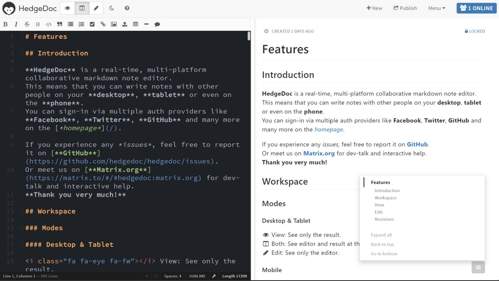

In diesem Beitrag geht es um die Inhalte des ersten Unterrichtsblocks vom Vormittag des 14. Februars 2024 (08:30 - 12:00). 

## Administratives

Im Ersten Teil haben wir viele Informationen zum Modul selbst erhalten. Der Dozent hat uns die Inhalte dessen anhand der Modulbeschreibung aufgezeigt und die Organisation des Moduls sowie den Leistungsnachweis erklärt. Er hat sich uns vorgestellt und uns einen Einblick in seine bisherige Erfahrung gegeben, welche ihn erst dazu befähigt dieses Modul zu unterrichten. Im Anschluss hatten wir die Gelegenheit uns selbst kurz vorzustellen und unsere bisherigen Erfahrungen und unsere Erwartungen ans Modul wurden abgeholt und festgehalten.  
Die meinen sind im [Einführungspost](https://sagerin94.github.io/Lerntagebuch_BAIN/2024/02/14/einfuehrung.html) des Blogs nachzulesen. 

### Fileshare

Um die erarbeiteten Inhalte festzuhalten, werden wir für jede Lehreinheit ein "gemeinsames Dokument" in Form einer [HedgeDoc-Installation der GWDG](https://pad.gwdg.de/). Dabei handelt es sich um einen kollaborativen Markdown-Editor, welcher die Zusammenarbeit in Echtzeit ermöglicht. Man hat die Möglichkeit das File auf drei verschiedene Arten anzuzeigen. In der Bearbeitung sieht man den Markdown-Editor und kann das File verändern. Die Ansicht zeigt einem das mit Markdown formatierte Dokument. Die Splitscreen Ansicht (*Beides*) ermöglicht einem das simultane Bearbeiten und Anzeigen im Stil eines [WYSIWYG-Editors](https://de.wikipedia.org/wiki/WYSIWYG) in Echtzeit.

*Abb. 1: Echtzeit-Ansicht der HedgeDoc-Installation (Bildquelle: https://pad.gwdg.de/)*

### Inhalte

Die Inhalte klingen grundsätzlich alle Interessant, ich glaube jedoch am Meisten gespannt bin ich auf den Block *Funktion und Aufbau von Bibliothekssystemen* da ich aktuell die grösste praktische Relevanz darin sehe für mich. Da ich aber generell noch nicht gross mit der Thematik und den verwendeten Standards vertraut bin, bin ich sicher, dass in jedem Block etwas Interessantes dabei sein wird und es viel Neues zu lernen gibt.   

## Arbeitsumgebung und GitHub 

Im zweiten Teil des Morgens wurden wir dazu aufgefordert ein User-Konto auf GitHub zu erstellen. Durch die Funktion der Codespaces wird uns ermöglicht, ohne grossen Aufwand, eine virtuelle Linux-Umgebung zu verwenden. In Vorbereitung für die Lektion am Nachmittag wurde uns umfassend erklärt, wie wir diese Codespaces öffnen können und wir wurden darauf hingewiesen, dass wir die Codespaces wieder Löschen sollen, wenn wir sie nicht weiter verwenden. Für neue Übungen ist es sowieso von Vorteil, mit einer neuen Umgebung zu starten, weil man wieder auf einem *sauberen* Stand anfangen kann. 

<!--- Da ich bereits ein GitHub Konto besass (wenn ich so daüber nachdenke, so besassen wohl alle aus der Klasse schon eines, denn ich glaube wir haben dies im Rahmen eines früheren Moduls erstellt) und ich auch keine Mühe hatte den Codespace zu starten und zu schliessen war dieser Teil für mich etwas langatmig. -->

